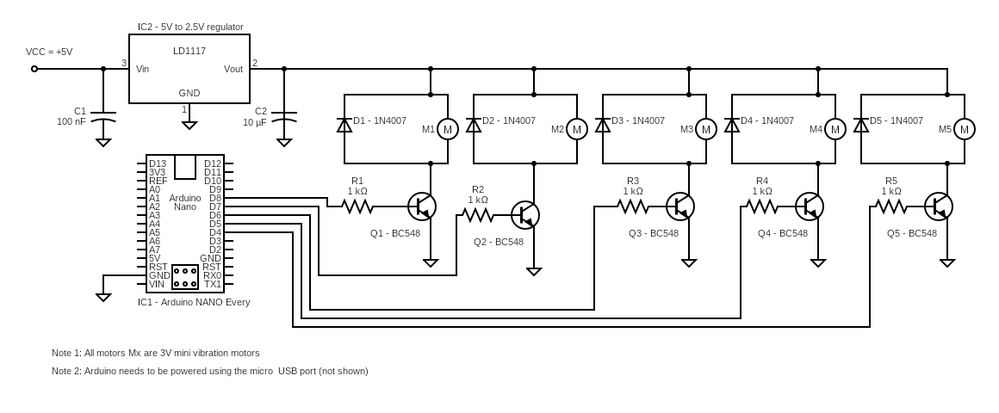

# 24017 - VIBROSHAKER MUSICAL INSTRUMENT WITH ARDUINO NANO EVERY
---

In this project we are introducing a new musical instrument called the vibroshaker which is inspired by the popular shaker percussion instrument. Vibroshaker uses Arduino Nano Every as the brains that allows it to play itself! You can program different beats and accompany your favorite music tracks with this vibroshaker. 

Following is the circuit diagram of the vibroshaker.

You can access the Arduino Nano Every software code using the following link.

Inside the loop() function, you will see calls to the following three functions

  drum_and_bass_1();
  malibu_loop_1();
  swing_loop_1();

Simply comment out the ones you do not want to use, compile and upload the one you want to play with! Better still, use the existing tracks to create new ones you want to play. Sky is the limit and there are so many rhythms you can create for your vibroshaker!

You can use the following mp3 track to play along:

1 - For **drum_and_bass_1();** vibroshaker code, use backtrack 

2 - For **malibu_loop_1();** vibroshaker code, use backtrack 

3 - For **swing_1_loop();** vibroshaker code, use backtrack 

The above code is just a simple example to help you make a quick start to create the device demonstrated in **<u>[project video][1]</u>**, there are many other things you can do by introducing simple modifications to this basic code.

## Shopping List
Following is a short shopping list to get the critical parts for the vibroshaker:

1 - Shaker tubes: www.amazon.com/gp/product/B07SFMFB1Q

2 - Vibration motors: www.amazon.com/gp/product/B07Q1ZV4MJ

3 - Arduino Nano Every: www.amazon.com/gp/product/B07YQ56B6Q

4 - Shaker beads: There is no particular brand to use here. Just get a few different types from your local crafts store that carries jewelry making items.

If you build this project, please share your thoughts and suggestions with the rest of circuitapps community in the comments section of **<u>[our YouTube video][1]</u>**. Also, please feel free to talk about any interesting modifications you make and your experimentations!

## Project Challenges
1 - You may need to adjust the amount of beads in each shaker to generate the optimum sounds. Putting too many beads in a shaker may make it hard for the vibration motors to handle, therefore no sound can be generated.

2 - While attaching each vibration motor to the shaker tube, be sure to create a tight connection. The vibration motor needs to make full contact with the bottom of each tube.

## Useful tips
Following are a few tips you can use during your experimentation:
1 - You can also change the dimensions and the material of each shaker tube to create different sounds.

2 - You can also use different types of beads in each shaker tube to vary the sounds generated. Our recommendation is to use the same type of beads in all of the shakers to start with and adjust the amount. That way you will be able to generate different tones more consistently.

3 - Though we have created the vibroshaker with 5 shaker tubes you can have more tubes to get a finer tone variation, if needed. You can also have multiple tubes for each tone to generate a louder sound!

GOOD LUCK & ENJOY EXPERIMENTING WITH THE VIBROSHAKER

[1]: <PLACE YOUTUBE LINK TO GUIDE VIDEO HERE>
